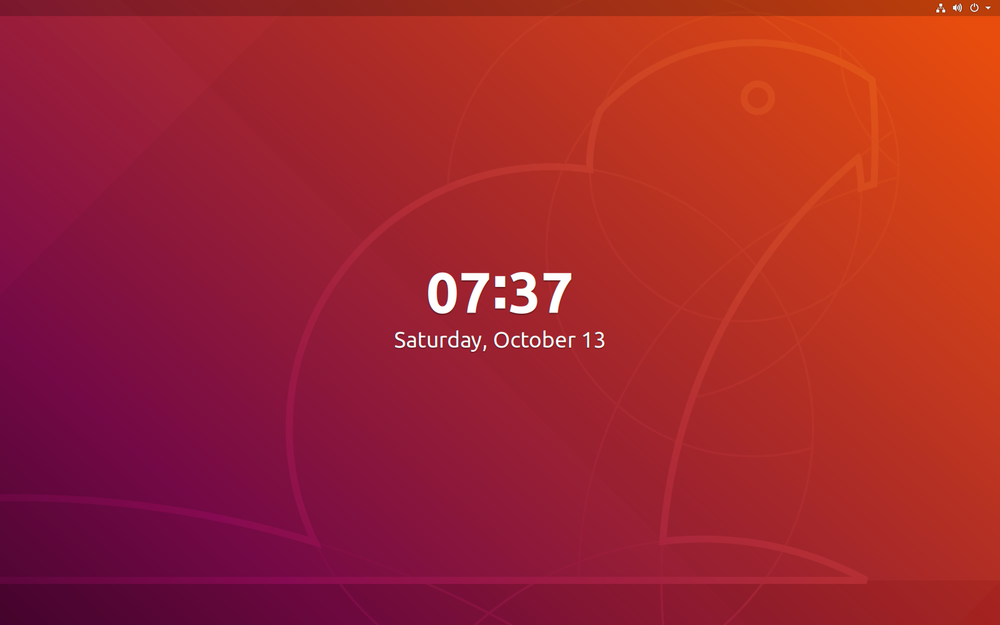

# Lab Setup: Initial Lab Setup

## Downloading and starting VMWare Fusion with Ubuntu 18 image

### Introduction

This isn't a lab as much as the setup for what **will** be our labs. The first rule of creating any application is to ensure that we are all on the same environment (in order to prevent the dreaded "IT WORKED FINE ON MY COMPUTER I SWEAR!" excuse)

### Step One: Downloading the necessary components

For this lab we'll be utilizing [vmware_fusion](https://www.vmware.com/uk/products/fusion.html) to host our environment. Our first step will be to [download](https://www.vmware.com/uk/products/fusion/fusion-evaluation.html) version 11 of vmware fusion (don't worry about using the **pro**...the plain one is fine.). 

### Step Two: Register and set up the master password and username

So there are a bunch of steps to go through here. Instead of going through and doing a bunch of screen shots I'll just leave it to you guys to fill everything out. _One note of warning_: keep the username and password simple. We will not be storing Nuclear codes on this server; this is simply going to be used for the exercises here. In other words: _password_ / _password_ is perfectly fine.

### Step Three: Getting the image

Obviously just having a virtual machine isn't enough; we also need an image to form our OS. For this project we will be using a linux distribution known as [ubuntu](https://www.ubuntu.com/)- which is used all the time and works well with GoLang. Let's download the image for the ubuntu server [here](https://www.ubuntu.com/download/desktop). Once you have that iso image downloaded (we are looking for the **ubuntu server** and not **ubuntu desktop**) we need to load it into our VM Fusion machine. Open up vmware fusion until you get to this screen:

Now go to your downloads folder, grab the iso image that you just downloaded, and drag it into the appropriate vmware area. Now wait about a ten minutes for everything to boot up.
When this step completes you should see a screen that looks something like this:

### Step four: Set up your ubuntu machine

We now have a functioning ubuntu machine running. Go through the setup steps. A couple of quick notes that we *need* to pay attention to:

* You will want to mount your home directory folder. I would reccommend the folder where you have cloned this repo in to...but you can put it anywhere.
* You might want to grab some packages like the aws-cli (this is optional- we won't be using it in this tutorial but it's probably one of the most commonly used packages)
* Use an easy-to-remember username and password. Again- not protecting Nuclear missiles here...so don't worry about using a simple password

### Step five: Reboot your machine

So now let's reboot our ubuntu machine
Basically at this point we want to reboot the entire virtual machine. At the end you should get a screen that looks like this:

Login using the credentials that we set up before. This is basically what you will have to do every time we start up our machine. **WELCOME TO YOUR VM**

### Step six: Do some basic checks

At this point you should see a screen that looks something like this:

Now let's log in and get the cli up- which is the primary thing we'll be working with. Log in using the login that you set up  in the previous step. Once logged in you should have a basic ubuntu screen ready to go. If you want to- take a minute to familiarize yourself (that rhythymbox thing is kind of cool...I guess). 
We'll be working primarily with the cli going forward so the next step is to do a `cmd-alt-t` to call up the terminal shell. This should look like pretty much every other terminal:

So now we have a **cli** (command-line-interface) ready to go. This is the primary way we'll interface with our ubuntu machine. The first thing we're going to want to do is make sure that we have an effective internet connection and the ability to download the packages we need. Please run the following commands:

* `ping www.google.com` - you should get something back that says __64 bytes from .... icmp_seq=1 ttl=128__ which is basically google returning your "ping". CONGRATULATIONS- you're connected to the internet.

Okay- now that we're completely set up let's download all necessary software packages. Ubuntu, by default, uses [apt-get](http://manpages.ubuntu.com/manpages/bionic/man8/apt-get.8.html) to manage packages. The first thing we always want to do when we create a new virtual machine is to run an update and and upgrade. Fortunately on the command line this is super easy to do. Run the following command:
`sudo apt-get update && sudo apt-get upgrade`
The **sudo** gives you **root** user permissions to update and upgrade. 
Grab a coffee- this will take a few minutes to run. 

### Step seven: mount the pre-set up golang structure:

To **mount** a folder in a vmware fusion machine basically means that we can access files on the host through the vmware machine. To do this we want to use the **file sharing** functionality in our vmware machine. So to mount:

1. Navigate to the **Virtual Machine** drop down on the top row of the host machine (when vmware is selected)
2. Select the **Shared settings...** selection. A pop up will appear asking what folders you want to mount.
3. Click the "+" sign and you will be able to navigate to the correct folder on your host. That correct folder should be the "go" folder two levels up from this lab instruction (the root directory for this repo).
4. The permissions should be read/write
5. Now we need to check that this worked...open up a terminal (`ctrl-alt-t`) and use the following command to navigate to the section of the virtual machine that the mounted files go to- which is the __/mnt/hgfs__ (mount/host-group-file-service is what that stands for..I think). 
6. To get there type the following command into your terminal: `cd /mnt/hgfs && ls` (change-directory to... and then list the files there). You should see a simple directory in there that says **go**. This is where we will be doing most of our work! 

### Step eight: install goLang

Okay- we're ready to install goLang itself! To do this step we will again go with the ubuntu package manager...which makes this really easy:
`sudo apt-get install golang` is the only command we need for this part. Now the packages should download. Grab another coffee (you caffienated enough yet?!?)

So another note: Golang depends heavily on the **GOPATH** variable- which we have to set in our environment. We need this **GOPATH** variable to point to the directory that we will be working with golang in. The simple way to set this is to run the `export GOPATH='/mnt/hgfs'` BUT...that will only allow that environment variable to exist until we shut the computer down.
We want this to be there every time. 
By default the GOPATH variable was set to **/$HOME/go/** but, of course...we're using mounted files so that won't work for us. 
**INSTEAD** we're going to add this command to our **~/.bash_profile** which is a nifty little file that is read every time we start up a shell terminal (we can do all sorts of neat thing with this file like add **alias'** or change our screen colour scheme!)

Type in the following command: `vi ~/.bash_profile` This should open up a blank text editor. Type the `i` key for **INSERT**. An INSERT should come up at the bottom of the screen. Write the following into the text editor:
`export GOPATH='/mnt/hgfs/go'`. Save and close the text editor by typing `esc` then `:wq`. This should close the text editor. 

### Step nine: Test our installation of go

So I have included a **test** folder in the __go/__ directory. Let's run a quick test to make sure our installation works:

1. Change directories to our go folder: `cd /mnt/hgfs/go/src/test/`
2. Run a **build** command against the **test.go** file in there by running `go build` from within that directory.
3. Run an `ls`. Did a new file called **test** appear (without the **.go** extension added to the end of it?) THIS is one of the most powerful features of GO that we'll get in to in the lecture portion (it's the binary). Let's run it...
4. Type in `./test`. Did a message appear on your screen? 
5. Now let's clean up by putting this bad boy into our **/bin** folder (binary files go here) by typing in `go install`. Did the file disappear? Check the bin file!

### Step ten: Finish up! 
Congratulations! We are ready to proceed with our golang project!
