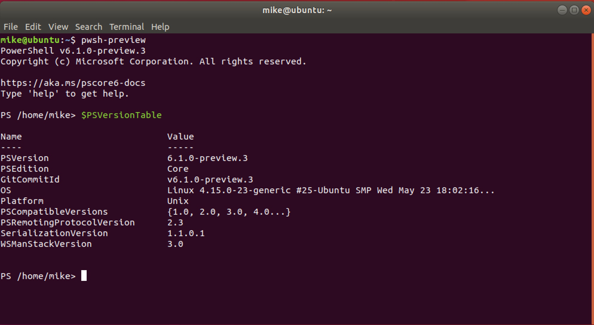

# Lab One: Initial Lab Setup

## Downloading and starting VMWare Fusion with Ubuntu 18 image

### Introduction

This isn't a lab as much as the setup for what **will** be our labs. The first rule of creating any application is to ensure that we are all on the same environment (in order to prevent the dreaded "IT WORKED FINE ON MY COMPUTER I SWEAR!" excuse)

### Step One: Downloading the necessary components

For this lab we'll be utilizing [vmware_fusion](https://www.vmware.com/uk/products/fusion.html) to host our environment. Our first step will be to [download](https://www.vmware.com/uk/products/fusion/fusion-evaluation.html) version 11 of vmware fusion (don't worry about using the **pro**...the plain one is fine.). 

### Step Two: Register and set up the master password and username

So there are a bunch of steps to go through here. Instead of going through and doing a bunch of screen shots I'll just leave it to you guys to fill everything out. _One note of warning_: keep the username and password simple. We will not be storing Nuclear codes on this server; this is simply going to be used for the exercises here. In other words: _password_ / _password_ is perfectly fine.

### Step Three: Getting the image

Obviously just having a virtual machine isn't enough; we also need an image to form our OS. For this project we will be using a linux distribution known as [ubuntu](https://www.ubuntu.com/)- which is used all the time and works well with GoLang. Let's download the image for the ubuntu server [here](https://www.ubuntu.com/download/desktop). Once you have that iso image downloaded (we are looking for the **ubuntu server** and not **ubuntu desktop**) we need to load it into our VM Fusion machine. Open up vmware fusion until you get to this screen:

Now go to your downloads folder, grab the iso image that you just downloaded, and drag it into the appropriate vmware area. Now wait about a minute for everything to boot up.

### Step four: Set up your ubuntu machine

We now have a functioning ubuntu machine running. Go through the setup steps. A couple of quick notes that we *need* to pay attention to:

* You will want to mount your home directory folder. I would reccommend the folder where you have cloned this repo in to...but you can put it anywhere.
* You might want to grab some packages like the aws-cli (this is optional- we won't be using it in this tutorial but it's probably one of the most commonly used packages)
* Use an easy-to-remember username and password. Again- not protecting Nuclear missiles here...so don't worry about using a simple password

### Step five: Reboot your machine

So now let's reboot our ubuntu machine
Basically at this point we want to reboot the entire virtual machine. At the end you should get a screen that looks like this:

Login using the credentials that we set up before. This is basically what you will have to do every time we start up our machine. **WELCOME TO YOUR VM**

### Step six: Do some basic checks

At this point you should see a screen that looks something like this:

So now we have a **cli** (command-line-interface) ready to go. This is the primary way we'll interface with our ubuntu machine. The first thing we're going to want to do is make sure that we have an effective internet connection and the ability to download the packages we need. Please run the following commands:

* `ping www.google.com` - you should get something back that says __64 bytes from .... icmp_seq=1 ttl=128__ which is basically google returning your "ping". CONGRATULATIONS- you're connected to the internet.
*   

Okay- now that we're completely set up let's download all necessary software packages. Ubuntu, by default, uses [apt-get](http://manpages.ubuntu.com/manpages/bionic/man8/apt-get.8.html) to manage packages. The first thing we always want to do when we create a new virtual machine is to run an update and and upgrade. Fortunately on the command